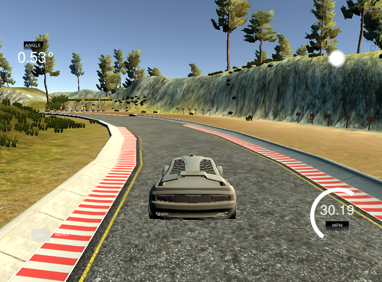

# Project: Behavior Cloning 

Jun Zhu

## Overview

In this project, a deep learning model which can drive the car automatially in a [simulator](https://github.com/udacity/self-driving-car-sim) was trained. There are three cameras (left, center and right) mounted in the car and they will take pictures when the car is running. The image data saw by the car were first fed into a convolutional neural network (CNN). After that, the well-trained model will be used to predict the steering angle of the car in the autonomous mode in the simulator to keep the car in the main road. This approach was first published at ["End to end learning for self-driving cars"](https://arxiv.org/abs/1604.07316).

The detailed pipeline can be found in [summary-behaviorCloning.ipynb](summary-behaviorCloning.ipynb).

