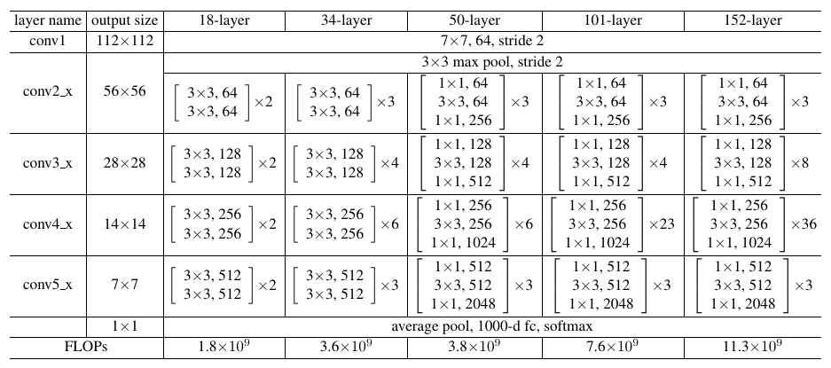
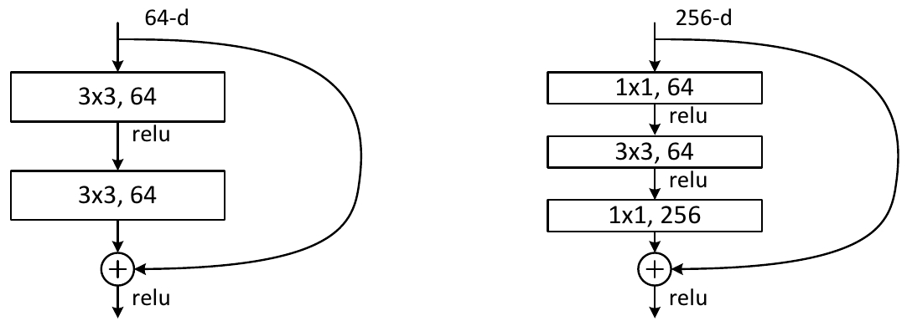

# Implements of VGG, ResNet, Inception, Xception in Keras

Jun Zhu

---

## VGG

## ResNet

This repository contains the **original ResNet models** (ResNet-18, ResNet-34, [ResNet-50](http://ethereon.github.io/netscope/#/gist/db945b393d40bfa26006), [ResNet-101](http://ethereon.github.io/netscope/#/gist/b21e2aae116dc1ac7b50), and [ResNet-152](http://ethereon.github.io/netscope/#/gist/d38f3e6091952b45198b)) described in the paper [Deep Residual Learning for Image Recognition](http://arxiv.org/abs/1512.03385), as well as **arbitrary ResNet models**.

<figure>
  
  <figcaption>Figure: Architechture for ResNet with different depths.</figcaption>
</figure>

<figure>
  
  <figcaption>Figure: Identity block (left) and bottleneck block (right).</figcaption>
</figure>

## Inception

### Inception-v3
### Inception-ResNet-v1
### Inception-v4
### Inception-ResNet-v2

## Xception

## Requirements

- python3>=3.6.2
- tensorflow>=1.4.0
- keras>=2.1.2
- opencv>=3.1.0
- tqdm>=4.19.4

## Run

### CIFAR10 dataset

```sh
python cifar10.py
```


### [Caltech101 dataset](http://www.vision.caltech.edu/Image_Datasets/Caltech101/)

```sh
python caltech101.py
```

### [Caltech256 dataset](https://authors.library.caltech.edu/7694/)

```sh
python caltech256.py
```