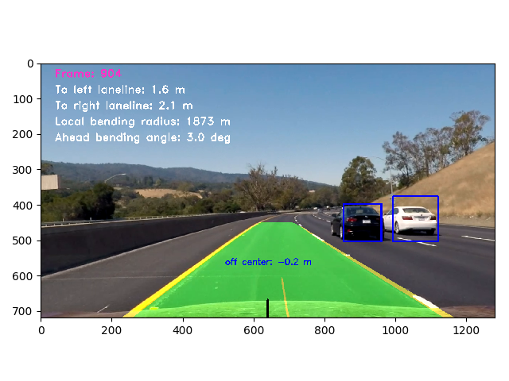
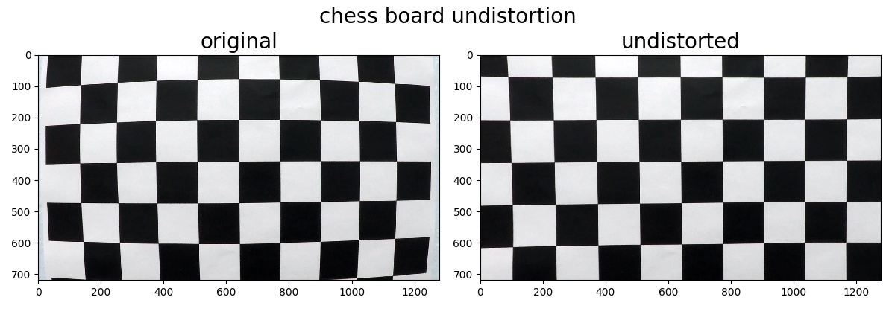
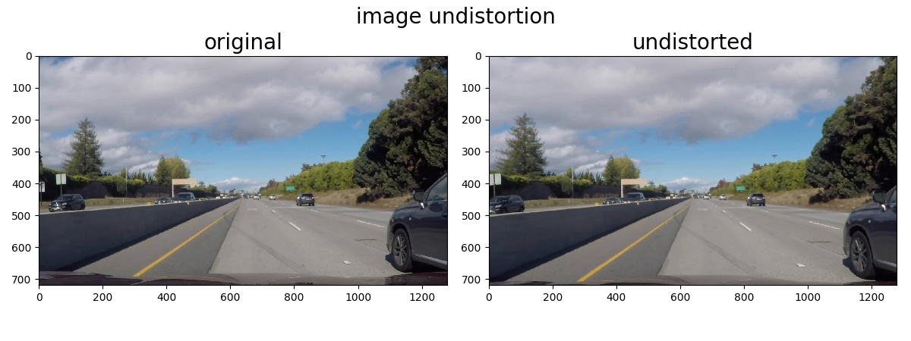
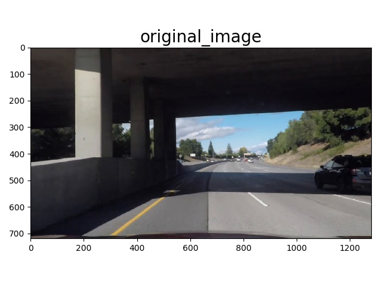
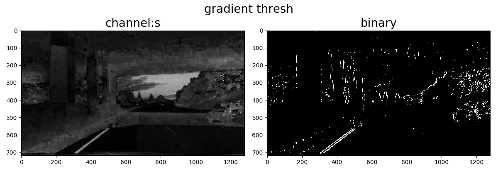
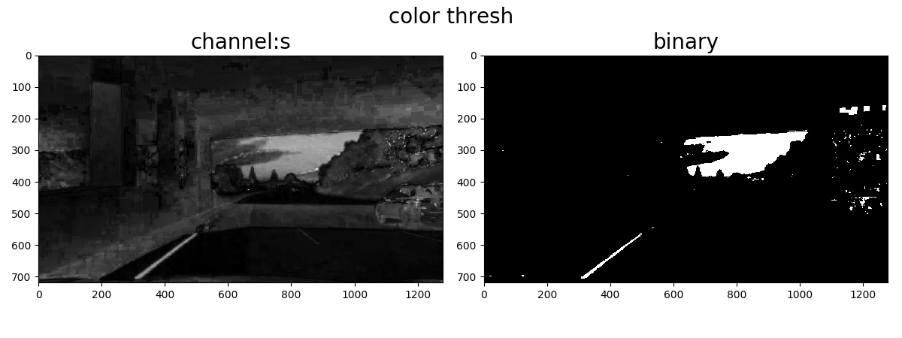
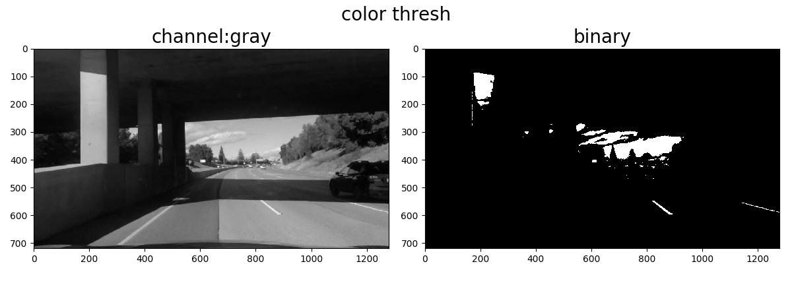
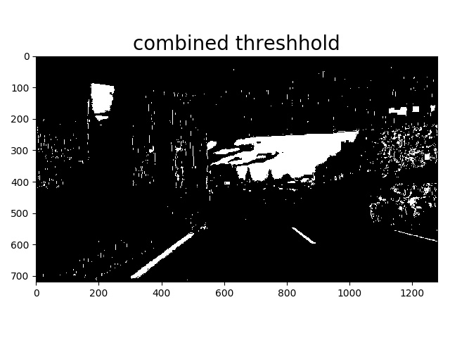
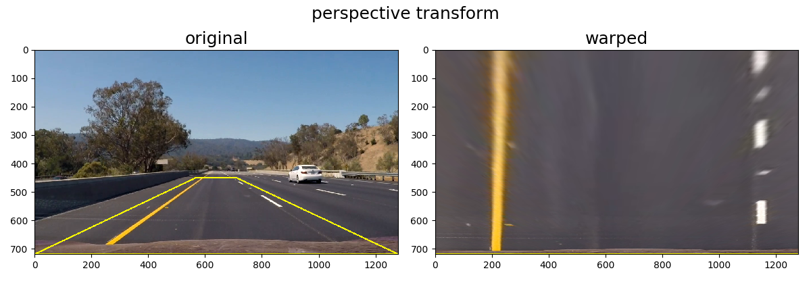

# Advanced Lane Line Finding and Vehicle Detection

Jun Zhu

##Camera Calibration

The camera distortion was calibrated by the [chessboard images](./camera_cal/). The chessboard was assumed to be fixed on the (x, y) plane at z=0, such that the object points are the same for each calibration image.

Then the output `obj_points` and `img_points` were used to calculate the camera calibration and distortion coefficients using the `cv2.calibrateCamera()`.  The result was saved in the file "./camera_cali.pkl". Undistortion of the test image "camera_cal/calibration1.jpg" using `cv2.undistort()` is shown below: 

##LaneLine Detection

Image undistortion -> threshold -> perspective transform ->

### 1. Undistortion

### 2. Threshold
A combination of color and gradient thresholds was used to generate a binary image. The processing of a screenshot with shadown on the road is shown in the following:

The gradient threshold in a grayscale image sometimes introduce many outliers. Here the gradient threshold was applied along the x direction in the HLS-S channel.

The most efficient way of finding the yellow line is to apply the color threshold in the HLS-S channel.

It is obvious that the white line cannot be found out by the above two threshold methods. In order to get the while line in certain images, the color threshold was applied in the grayscale image.

Finally, the above binary images were combined to get the final result.

### 3. Perspective transform.

### 4. Lane line search and fit

## Vehicle Detection

[vehicles](https://s3.amazonaws.com/udacity-sdc/Vehicle_Tracking/vehicles.zip)

[non-vehicles](https://s3.amazonaws.com/udacity-sdc/Vehicle_Tracking/non-vehicles.zip) 

The total number of data is 17760 and the total number of features is 1323 (441x3). 

### 1. Histogram of Oriented Gradients (HOG)

### 2. Local Binary Pattern (LBP) 

## References

- [Histograms of Oriented Gradients for Human Detection](http://www.csd.uwo.ca/~olga/Courses/Fall2009/9840/Papers/DalalTriggsCVPR05.pdf) - the original HOG paper
- [Implementation of HOG for Human Detection](http://www.geocities.ws/talh_davidc/#cst_extract) - A very good explanation of HOG
- [Local Binary Patterns with Python & OpenCV](http://www.pyimagesearch.com/2015/12/07/local-binary-patterns-with-python-opencv) - A very good explanation of LBP
- [(Faster) Non-Maximum Suppression in Python](http://www.pyimagesearch.com/2015/02/16/faster-non-maximum-suppression-python/) - Not the implementation in this project, but a very interesting poster.