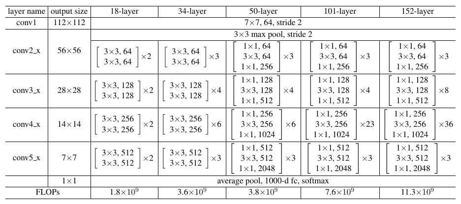
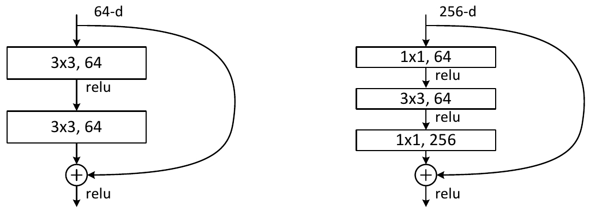

# Implement ResNet in Keras

Jun Zhu

---

## Introduction

This repository contains the **original ResNet models** (ResNet-18, ResNet-34, [ResNet-50](http://ethereon.github.io/netscope/#/gist/db945b393d40bfa26006), [ResNet-101](http://ethereon.github.io/netscope/#/gist/b21e2aae116dc1ac7b50), and [ResNet-152](http://ethereon.github.io/netscope/#/gist/d38f3e6091952b45198b)) described in the paper [Deep Residual Learning for Image Recognition](http://arxiv.org/abs/1512.03385), as well as **arbitrary ResNet models**.

<figure>
  
  <figcaption>Figure: Architechture for ResNet with different depths.</figcaption>
</figure>

<figure>
  
  <figcaption>Figure: Identity block (left) and bottleneck block (right).</figcaption>
</figure>

## Requirements

- python3>=3.6.2
- tensorflow>=1.3.0
- keras>=2.0.8

## Run

### CIFAR10 dataset

```sh
python cifar10.py
```


### VOC2012 dataset
