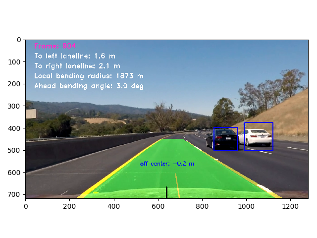

# Advanced Lane Line Finding and Vehicle Detection

[](http://www.udacity.com/drive)

Jun Zhu

This is a combination of the advanced lane line finding and the vehicle detection projects.



## Camera Calibration and image undistortion 

```
python unitttest_camera_calibration.py
```

The camera distortion was calibrated by the [chessboard images](./camera_cal/). The chessboard was assumed to be fixed on the (x, y) plane at z=0, such that the object points are the same for each calibration image.


## Lane line finding

pipeline: perspective transformation -> threshold -> lane line search -> curve fit -> inverse perspective transformation

### Perspective transformation.

Perspective transformation can only be finely tuned by eyes. A plot will pop out at the beginning of the video processing to let you check the perspective transformation result.


#### Threshold

```
python unittest_threshold.py
```

Both color and gradient thresholds have been implemented.

#### Lane line search


#### Curve fit


#### Inverse perspective transformation

Transform the lane lines in the bird view image back to the original image.

## Vehicle detection

pipeline: train a classifier -> feature extraction (sliding window) -> vehicle classification

#### Vehicle and non-vehicle data

[vehicles](https://s3.amazonaws.com/udacity-sdc/Vehicle_Tracking/vehicles.zip)

[non-vehicles](https://s3.amazonaws.com/udacity-sdc/Vehicle_Tracking/non-vehicles.zip) 

The sizes of the images in the data set are all **64 x 64**. These data come from [GTI vehicle image database](http://www.gti.ssr.upm.es/data/Vehicle_database.html) and [KITTI Vision Benchmark Suite](http://www.cvlibs.net/datasets/kitti/).

#### Feature extraction

```
python unittest_feature_extraction.py
```

 Two algorithms have been implemented in this project: Histogram of Oriented Gradients (HOG) and Local Binary Pattern (LBP) 

sliding window feature extraction: The size of the original image will be scaled, but the window size is always 64x64. In order to detect vehicles in an image, the sliding window method should be applied multiple times using different scales and different search regions.

#### Vehicle classification

```
# delete the file "car_classifier.pkl" to train a new classifier
python unittest_car_classifier.py
```

After the sliding window feature extraction, each window will be classified by a well-trained classifier (here the Linear SVM). A greedy algorithm [non-maxima-suppression](http://www.pyimagesearch.com/2015/02/16/faster-non-maximum-suppression-python/) will be used to remove duplicated car windows.

***To get better result, the classifier needs to be improved. For instance, get more high-quality data.***

## References

- [Histograms of Oriented Gradients for Human Detection](http://www.csd.uwo.ca/~olga/Courses/Fall2009/9840/Papers/DalalTriggsCVPR05.pdf) - the original HOG paper
- [Implementation of HOG for Human Detection](http://www.geocities.ws/talh_davidc/#cst_extract) - A very good explanation of HOG
- [Local Binary Patterns with Python & OpenCV](http://www.pyimagesearch.com/2015/12/07/local-binary-patterns-with-python-opencv) - A very good explanation of LBP
- [Real time Detection of Lane Markers in Urban Streets](https://arxiv.org/abs/1411.7113)