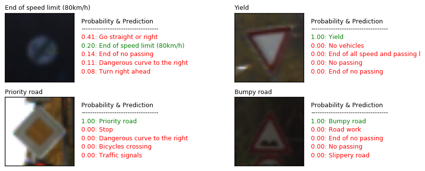

# Project: Build a Traffic Sign Recognition Program
[](http://www.udacity.com/drive)

Jun Zhu



## Overview

In this project, a convolutional neural network (CNN) was build to classify traffic signs. The [data](https://d17h27t6h515a5.cloudfront.net/topher/2016/November/581faac4_traffic-signs-data/traffic-signs-data.zip) used in training and testing this model, which are provided by Udacity, come from the [German Traffic Sign Dataset](http://benchmark.ini.rub.de/?section=gtsrb&subsection=dataset). It is a pickled data set in which all the images have been resized to 32x32.

## Final result

The CNN structure is: Input -> conv -> relu -> conv -> relu -> pooling -> conv -> relu -> conv -> relu -> pooling -> conv -> relu -> conv -> relu -> pooling -> dropout -> fully-connected -> relu -> dropout -> fully-connected - relu -> output. The accuracies on the training, validaton and testing data set are **0.9938**, **0.9960** and **0.9758** respectively.

The projected was written in Jupyter notebook, which can be found at [GermanTrafficSign_Tensorflow.ipynb](./GermanTrafficSign_Tensorflow.ipynb).

## Working on AWS GPU

1. You will need an AWS account with permission to use EC2 GPU instances;

2. Select an AMI (with setup environment), e.g. udacity-carnd;

3. Select an GPU instance type, e.g. g3.4xlarge;
 
4. Adjust the storage size (if necessary);

5. Configure the security group. For Jupyter notebook, you will need add a TCP port 8888;

6. Launch the instance.

7. Copy your files to the instance.

8. Log in
   `ssh carnd@ec2-52-58-44-132.eu-central-1.compute.amazonaws.com(your Public DNS (IPv4))`

9. Upgrade or install packages
    ```sh
    $ pip install --upgrade pip
    $ pip install tensorflow-gpu
    $ pip install tensorflow-gpu --upgrade
    $ pip install keras
    $ pip install keras --upgrade
    ```
10. Solve the CUDA problem :(
    ```
    $ sudo apt-get remove nvidia-*
    $ wget http://us.download.nvidia.com/XFree86/Linux-x86_64/367.57/NVIDIA-Linux-x86_64-367.57.run
    $ sudo bash ./NVIDIA-Linux-x86_64-367.57.run  --dkms
    ```
    Solve the cudnn program :(  https://yangcha.github.io/Install-CUDA8/
    ```
    $ wget http://developer.download.nvidia.com/compute/machine-learning/repos/ubuntu1604/x86_64/libcudnn6_6.0.21-1%2Bcuda8.0_amd64.deb
    $ sudo dpkg -i libcudnn6_6.0.21-1+cuda8.0_amd64.deb
    ```
    
11. Run Jupyter notebook

12. Access the Jupyter notebook locally from your web browser by visiting: [IPv4 Public IP of the EC2 instance]:8888

13. Download data to AWS. 
  
    In case that login is required, you can do
  - Simply go to the website with the data URL.
  - Send a request to download the data on Chrome.
  - Open up the developer-console Ctrl + Shift + C and go to the Network tab.
  - You will see a request with the name as the title of the compressed data file.
  - Right click it and go to Copy as -> Copy as cURL
  - Paste the contents on AWS with `> filename`

14. Enjoy
